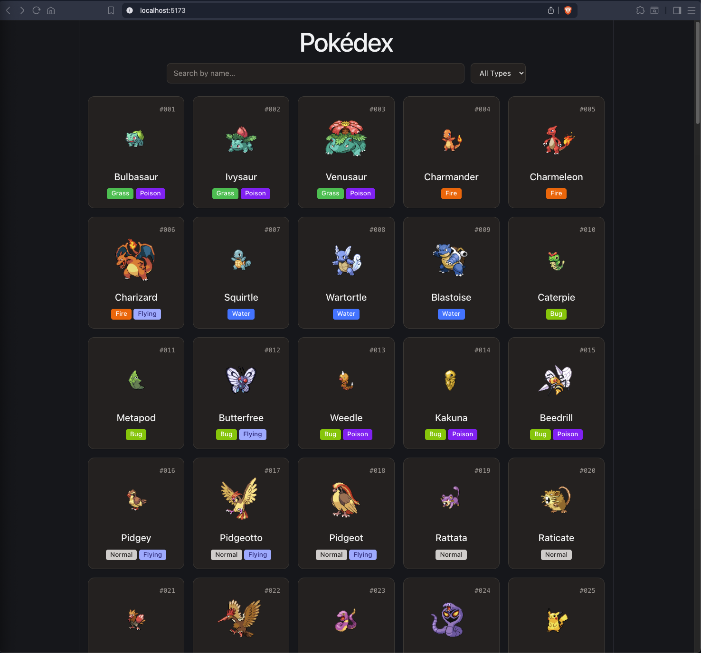

# Pokédex Challenge


A single-page application displaying the original 151 Pokémon with name search and type filtering, built with React, TypeScript, Vite, and Tailwind v4.

## Setup
```bash
npm install
npm run dev
```

Open the URL Vite prints (usually `http://localhost:5173`).

## Stack
- **React 19** with TypeScript
- **Vite 8** for dev server and build
- **Tailwind CSS v4** for styling (using the new `@tailwindcss/vite` plugin — CSS-first config, no `tailwind.config.js`)
- **[PokéAPI](https://pokeapi.co)** as the data source

## Architecture

### Data flow
```
PokéAPI ──▶ fetchAllPokemon() ──▶ usePokemon ──▶ PokemonGrid ──▶ PokemonCard
(source)      (API layer)          (state)        (filters)      (presentation)
```
Each layer has a single responsibility. Types are defined once in `src/types.ts` and flow through unchanged.

### Parallel fetching
The PokéAPI `/pokemon?limit=151` endpoint returns only names and URLs - not types or sprites. Rendering the grid requires a detail fetch per Pokémon, which means 151 additional requests.

I fire them in parallel with `Promise.all`:

```ts
const pokemonDetails = await Promise.all(
    data.results.map(async (pokemon) => {
        const detailResponse = await fetch(pokemon.url);
        const detailData = await detailResponse.json();
        return { /* normalized shape */ };
    })
);
```

Sequential `await` in a loop would take ~15 seconds (151 x ~100ms). In parallel it completes in ~1-2 seconds, bounded by the slowest single request rather than the sum.

### API boundary vs. domain types
The PokéAPI detail endpoint returns dozens of fields (abilities, moves, stats, cries, multiple sprite variants, etc.). I defined two separate types:

- `PokemonDetailResponse` - the narrow shape I consume from the API (only the 4 fields I need)
- `Pokemon` - the shape my app actually works with (id, name, sprite, types)

Normalization happens at the API boundary in `fetchAllPokemon`. The rest of the app only sees the `Pokemon` domain type. If the API schema changes, the blast radius is contained to one file. 

### Derived state for filters
The filter inputs (`searchName`, `selectedType`) are the only pieces of state related to filtering. The filtered array is recomputed on every render from `pokemon + searchName + selectedType`:

```ts
const filtered = pokemon.filter((p) => {
    const matchesName = p.name.toLowerCase().includes(searchName.toLowerCase());
    const matchesType = !selectedType || p.types.includes(selectedType);
    return matchesName && matchesType;
})
```

No `useEffect`, no stored derived state, no sync logic. For 151 items this is instant; at 10,000+ items I'd wrap in `useMemo` or move filtering to the server.

### No backend
PokéAPI *is* the backend. Adding a proxy server would have given me:
- Request caching (but PokéAPI is already CDN-backed)
- A DTO layer (but I have one - it's `PokemonDetailResponse` → `Pokemon`)
- Rate limit protection (but 151 request on page load isn't a rate limit concern)

For this scope, a backend would have been cargo-cult complexity. At scale (real traffic, authenticated features, multi-source aggregation, caching strategies), I'd introduce one.

## Project structure

```
src/
├── api/
│   └── pokemon.ts         # Fetch layer — returns normalized Pokemon[]
├── components/
│   ├── PokemonCard.tsx    # Single card with sprite, name, type badges
│   └── PokemonGrid.tsx    # Grid container, filter UI, loading/error states
├── hooks/
│   └── usePokemon.ts      # Custom hook wrapping fetchAllPokemon
├── types.ts               # Shared types (API response shapes + domain)
├── App.tsx                # Header + grid
├── index.css              # Tailwind entry point
└── main.tsx               # React root
```

## UI states
The `PokemonGrid` component handles four distinct states explicitly:

1. **Loading** - initial fetch in progress
2. **Error** - fetch failed
3. **Empty** - no Pokémon loaded (shouldn't happen in practice, handled defensively)
4. **No matches** - filters exclude all results (distinct from empty - the data is there, the filter hides it)

## What I'd do with more time
- **`Promise.allSettled` for partial failure handling.** Current behavior is fail-fast, if one of the 151 request fails, the whole load errors. In production I'd swap to `allSettled` so I can render the 150 that succeeded and surface (or retry) the one that failed.
- **Null sprite handling.** The PokéAPI schema allows `front_default` to be null. None of the 151 Kanto Pokémon actually return null, but my type currently coerces to an empty string as a simplification. A production version would render a placeholder component.
- **Abort controller in `usePokemon`.** React strict mode double-invokes effects in dev, which fires the fetch twice. An `AbortController` would cancel the first when the second starts. Harmless in production builds but cleaner for observability.
- **`useMemo` for filter results.** Unnecessary at 151 items; meaningful at 10,000+.
- **Backend caching layer.** Not needed for PokéAPI (CDN-backed, stable), but at scale I'd add a thin server to cache the denormalized Pokémon list, expose a single `/pokemon` endpoint returning everything needed for the grid, and lazy-load detail on demand.
- **Tests.** A small suite around `fetchAllPokemon` (mock fetch, assert shape), the filter predicate (pure function, easy to unit test), and the hook with `@testing-library/react`.

## Notes on choices
- **Tailwind v4** with the new `@tailwindcss/vite` plugin. CSS-first config (no `tailwind.config.js`), `@import "tailwindcss"` directive in `src/index.css`, ~19KB output after tree-shaking.
- **Dark mode** via Tailwind's `dark:` variants only — respects OS `prefers-color-scheme`, no JS toggle.
- **Type badges** use a record mapping type name → Tailwind classes. Not the official franchise colors; chose contrast-legible Tailwind palette variants instead.
- **Semantic HTML** — `<article>` for cards, `<header>` / `<main>` in `App.tsx`, `loading="lazy"` on sprites for deferred off-screen image loading.


> Built by Ilean Monterrubio Jr · [github.com/ileanmjr88](https://github.com/ileanmjr88)

